# 🤖 JARVIS AI VOICE ASSISTANT

<div align="center">
  
  
  
</div>

<div align="center">
  <h3>Your personal smart, sarcastic, and obedient AI assistant</h3>
  


</div>

## 📋 Overview

JARVIS (Just A Rather Very Intelligent System) is a personal AI voice assistant designed to be smart, slightly sarcastic, yet always obedient. Inspired by Tony Stark's AI companion, our JARVIS can help with daily tasks, provide information, and engage in natural conversations with personality.

## 🛠️ Tech Stack

- **🔄 [n8n](https://n8n.io/)** - Workflow automation platform
- **🔊 [Elevenlabs](https://elevenlabs.io/)** - Voice generation and optimization
- **🧠 [OpenAI API](https://openai.com/api/)** - Core AI capabilities
- **💾 Memory System** - Contextual awareness and conversation history
- **🤔 Thinking Model** - Advanced reasoning and decision making

## ✨ Features

- 💬 Natural conversational interface with a touch of sarcasm
- 📧 Send emails and messages
- 📝 Summarize meetings and create notes
- ✅ Task management and reminders
- 🌤️ Weather updates and forecasts
- 📰 News summaries and updates
- 🧮 Calculations and conversions
- 🔍 Web searches and information retrieval
- 🧠 Memory retention for personalized interactions

## 🚀 Setup Instructions

### 1. n8n Workflow Setup

1. Create a new workflow in [n8n](https://n8n.io/)
2. Add a webhook trigger node
3. Copy the webhook POST URL (There are two URLs: TEST and PROD)
   - Use TEST for development and testing
   - Use PROD for production deployment
4. Configure the workflow according to the diagram below

### 2. Voice Generation with ElevenLabs

1. Collect a minimum 30-second voice recording sample
2. Upload to [ElevenLabs](https://elevenlabs.io/) voice generation platform
3. Fine-tune the voice parameters to match desired JARVIS characteristics
4. Save and export the generated voice profile
5. Implement the ElevenLabs widget interface for the AI chatbot

### 3. AI Personality Script

Create a comprehensive script defining JARVIS's:
- Personality traits (smart, sarcastic yet obedient)
- Primary functions and capabilities
- Behavior guidelines and interaction patterns
- Error correction mechanisms
- Example interactions and responses

## 🔄 n8n Workflow Architecture

<div align="center">
  

</div>

The workflow consists of the following components:

1. **📡 Webhook Trigger** - Entry point for voice/text inputs
2. **🤖 AI Agent** - Processes inputs using the personality script
3. **🧠 OpenAI Integration** - Provides core AI capabilities
4. **💾 Memory Module** - Stores conversation history for context
5. **🔍 SerpAPI** - Enables internet searches for real-time information
6. **🧮 Calculator** - Performs mathematical operations
7. **🤔 Thinking System** - Enables complex reasoning and decision-making
8. **📣 Response Handler** - Formats and delivers the final response

## 📊 System Architecture

```mermaid
graph LR
    A["🔊 Voice Webhook"] -->|POST| B["🤖 AI Agent"]
    B -->|Process| C["✍️ Respond"]
    B -->|Chat| D["🧠 OpenAI Chat Model"]
    B -->|Store| E["💾 Memory"]
    B -->|Search| F["🔍 SerpAPI"]
    B -->|Calculate| G["🧮 Calculator"]
    B -->|Reason| H["💭 Think"]
    D --> B
    E --> B
    F --> B
    G --> B
    H --> B
```



## 🔧 Custom Tool Configuration

1. Create custom tools in n8n workflow
2. Paste the webhook POST URL into the tool configuration
3. Configure the necessary authentication and parameters
4. Test the tool with sample inputs

## 📝 Usage Examples

```
User: "Jarvis, what's the weather like today?"
JARVIS: "Looking outside would be faster, but since you asked... It's currently 72°F and sunny in your location."

User: "Summarize my last meeting."
JARVIS: "Your 2:00 PM meeting with the marketing team covered Q4 strategy. Key points: budget increase of 15%, new campaign launch in November, and hiring two new team members. Should I add any of these as tasks?"
```

## ⚙️ Advanced Configuration

<details>
<summary>Click to expand</summary>

### Memory System Optimization

Adjust memory parameters to balance between:
- Short-term conversation context
- Long-term user preferences
- Essential information retention

### Voice Customization

Fine-tune ElevenLabs parameters:
- Stability: 0.75 (recommended)
- Clarity + Similarity Enhancement: 0.85
- Style exaggeration: 0.30

### AI Response Optimization

Parameters for balancing personality:
- Sarcasm level: 0.4
- Helpfulness: 0.9
- Verbosity: 0.6
- Creativity: 0.7

</details>

## 🤝 Contributing

Contributions are welcome! Please feel free to submit a Pull Request.

## 📄 License

This project is licensed under the MIT License - see the LICENSE file for details.

## 🙏 Acknowledgements

- OpenAI for the powerful API
- ElevenLabs for voice generation technology
- n8n for the flexible workflow automation
- The Iron Man movies for the inspiration

---

<div align="center">
  <p>Made with ❤️ by Pranay DevOps and AI Automation</p>
  <p>© 2025 JARVIS AI Project</p>
</div>
